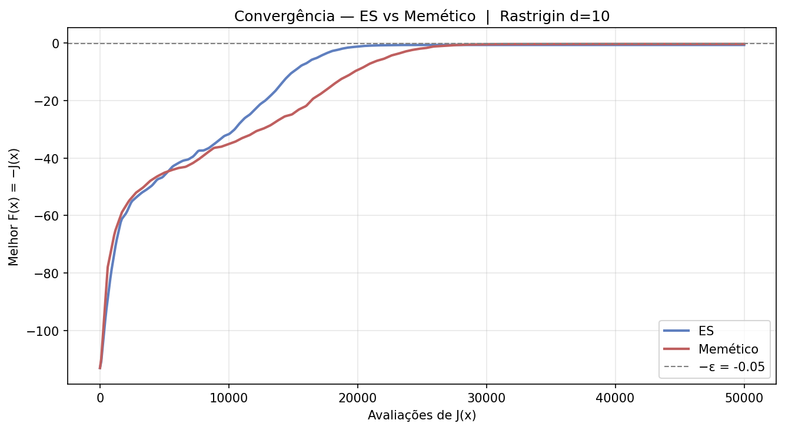
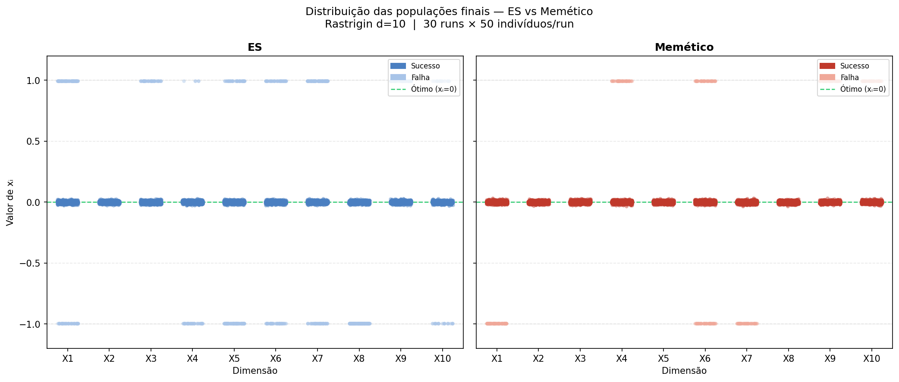

# ES vs. Memetic Algorithm on the Rastrigin Function

## Overview

This repository compares two nature-inspired optimisation algorithms on the **Rastrigin benchmark function**:

1. **Evolution Strategy (μ,λ)** with self-adaptive step sizes and recombination (`es_simples.py`)
2. **Memetic Algorithm** — the same ES augmented with a greedy local search phase (`em_simples.py`)

A **grid search** over key hyperparameters of the Memetic Algorithm at higher dimensionality (D=15) is also included (`em_gridsearch.py`).

## The Rastrigin Function

The Rastrigin function is a classic **multimodal benchmark** for continuous optimisation. It is defined as:

$$J(\mathbf{x}) = 10n + \sum_{i=1}^{n} \left[ x_i^2 - 10\cos(2\pi x_i) \right]$$

where $\mathbf{x} \in [-5.12,\, 5.12]^n$ and the global minimum is $J(\mathbf{x}^*) = 0$ at $\mathbf{x}^* = \mathbf{0}$.

**Why is it hard?**  
The cosine term creates a dense grid of local minima — approximately $10^n$ basins — separated by barriers of height $\approx 10$. At $n = 10$ the landscape has around 10 billion local attractors, making premature convergence to a sub-optimal basin the principal failure mode for any search algorithm.

## Algorithms

### 1. Evolution Strategy — (μ,λ) with Self-Adaptation

The ES maintains a population of μ parents and generates λ ≫ μ offspring per generation. Each individual carries both its position **x** and its own step-size vector **σ**, which evolves alongside the solution.

**Key operators:**

| Operator | Description |
|---|---|
| Recombination | Discrete on **x** (coin-flip per dimension); intermediate (mean) on **σ** |
| Mutation | Lognormal update of **σ** (Schwefel 1977), then Gaussian displacement of **x** |
| Selection | (μ,λ) — only offspring survive; prevents σ-collapse in local minima |

**Mutation equations (Schwefel 1977):**

$$\sigma_i' = \sigma_i \cdot \exp\!\left(\tau' \cdot \mathcal{N}(0,1) + \tau \cdot \mathcal{N}_i(0,1)\right)$$

$$x_i' = x_i + \sigma_i' \cdot \mathcal{N}_i(0,1)$$

where $\tau' = 1/\sqrt{2n}$ (global learning rate) and $\tau = 1/\sqrt{2\sqrt{n}}$ (local learning rate).

**Why (μ,λ) over (μ+λ) for Rastrigin?**  
The comma strategy discards all parents at each generation, preventing step sizes from collapsing around local minima and allowing the population to escape shallow basins through continued exploration.

### 2. Memetic Algorithm — ES + Greedy Local Search

A Memetic Algorithm (Moscato 1989) combines a population-level evolutionary search with an individual-level learning step. Here the learning step is a **greedy hill-climbing** local search applied after the ES offspring generation phase.

**Per-generation flow:**

```
1. Generate λ offspring via ES recombination + mutation  [λ evals]
2. Rank offspring by fitness
3. Apply greedy local search to the K best offspring     [K × depth evals]
4. Re-rank and select μ best → next generation
```

**Local search details:**

- Gaussian perturbation with fixed step σ_local = 0.5
- Depth = 50 trial steps per individual
- K = 3 individuals refined per generation (~6% of μ)
- **Lamarckian inheritance**: the improved position replaces the original in the population (not merely used for fitness evaluation)

**Budget fairness:**  
Both algorithms are compared under the same total evaluation budget (50,000 for D=10). The Memetic Algorithm spends roughly 550 evaluations per generation (400 ES + 3×50 local search), versus 400 for the plain ES. This is accounted for explicitly — comparisons are made in units of function evaluations, not generations.

**Fitness convention:**  
All algorithms internally maximise $F(\mathbf{x}) = -J(\mathbf{x})$. The success criterion is $J \leq \varepsilon = 0.05$, i.e.\ $F \geq -0.05$.

## Repository Structure

```
.
├── es_simples.py        # (μ,λ)-ES with self-adaptive σ — D=10
├── em_simples.py        # Memetic Algorithm (ES + local search) — D=10
├── em_gridsearch.py     # Grid search over (μ, λ, σ₀) — D=15
└── README.md
```

### Dependencies

```bash
pip install numpy pandas matplotlib
```

Python ≥ 3.9 recommended (uses `numpy.random.default_rng`).

---

## Running the Experiments

```bash
# ES only (30 independent runs, D=10)
python es_simples.py

# ES vs. Memetic comparison (30 runs each, D=10)
# Note: em_simples.py imports es_simples.py; both must be in the same directory
python em_simples.py

# Grid search over (mu, lambda, sigma0) for the Memetic Algorithm (D=15)
python em_gridsearch.py
```

Each script prints per-run logs and a summary table, then saves figures as `.png` files in the working directory.

## Experimental Protocol

| Parameter | Value |
|---|---|
| Independent runs | 30 |
| Random seeds | 42, 43, …, 71 (one per run) |
| Evaluation budget | 50,000 (D=10) / 100,000 (D=15) |
| Success threshold ε | 0.05 |
| Performance metrics | SR, SR_conv, MBF, AES |

**Metrics:**

- **SR** (Success Rate): fraction of runs reaching J ≤ ε.
- **SR_conv** (Extended Success Rate): fraction of runs where J ≤ ε *or* the convergence curve is convex (non-convex fraction nc < 0.20), indicating the algorithm converged smoothly even if ε was narrowly missed.
- **MBF** (Mean Best Fitness): mean of the best J found across all 30 runs.
- **AES** (Average Evaluations to Solution): mean number of J evaluations over successful runs.

## Results Summary

### D = 10  (budget = 50,000 evaluations)

| Algorithm | SR | MBF | AES |
|---|---|---|---|
| ES (μ=50, λ=400) | 60 % | 0.62 | 22,416 |
| Memetic (μ=50, λ=400, K=3) | **73.3 %** | **0.29** | 30,850 |

The Memetic Algorithm solves 22 of 30 runs; the local search phase provides the exploitation power needed to descend within a basin once the ES has navigated the search to a promising region.

### Grid Search — D = 15  (budget = 100,000 evaluations)

27 configurations (μ ∈ {50, 70, 100} × λ ∈ {200, 400, 600} × σ₀ ∈ {0.5, 1.0, 2.0}) were evaluated with 30 runs each (810 total runs).

**Top configuration by SR:** μ=100, λ=600, σ₀=2.0 → SR = 100%, MBF = 0.037  
**Top configuration by MBF:** same configuration.

Key finding: **λ/μ ratio is the dominant factor**. Configurations with λ < μ systematically fail (SR ≈ 0%) because selection pressure is too high and the step sizes collapse before the population can explore the landscape. σ₀ has secondary influence compared to population sizing.

## Convergence Curves

The figures below show **mean best F(x) = −J(x)** over 30 runs as a function of J evaluations (higher is better; target is F = 0).

| ES vs. Memetic convergence | Final population distribution |
|---|---|
|  |  |

Both algorithms start near F ≈ −100, reflecting random initialisation over a 10-dimensional domain where the expected Rastrigin cost is $\mathbb{E}[J] \approx 10n = 100$.

The convergence curves reveal a structural difference: the ES converges rapidly for the first ~20,000 evaluations (strong exploration driven by large initial σ) but stalls afterwards as step sizes shrink around local minima. The Memetic Algorithm converges more slowly in the early phase — local search consumes evaluations — but continues improving throughout the budget, eventually crossing the success threshold.

The scatter plot confirms this: the ES final population clusters at integer Rastrigin basins (x_i ≈ ±1, ±2, …), while the Memetic Algorithm's successful runs concentrate tightly around the global optimum x_i = 0.


## References

- Schwefel, H.-P. (1977). *Numerische Optimierung von Computer-Modellen mittels der Evolutionsstrategie*. Birkhäuser.
- Moscato, P. (1989). On Evolution, Search, Optimization, Genetic Algorithms and Martial Arts. *Caltech MPS Report 826*.
- Eiben, A. E. & Smith, J. E. (2015). *Introduction to Evolutionary Computing* (2nd ed.). Springer.
